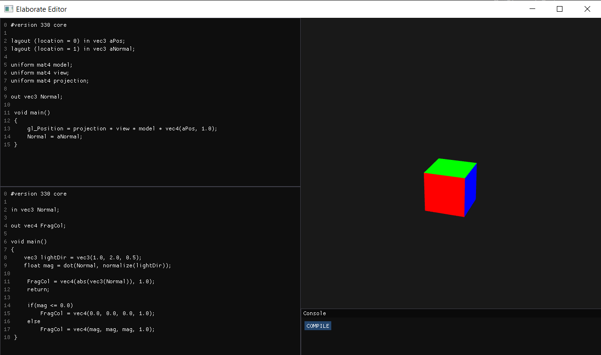

# ElaborateEditor
### A Cross-platform GLSL Editor

ElaborateEditor is a standalone editor for writing and testing vertex and fragment shaders. Currently it supports a simple cube mesh which displays the applied shaders in the viewport.
This will change in the future as more features and primitives are added.

## Getting Started
You will need CMake v.3.21 or above to build the project solution on your machine. To run on windows, execute the build_win.bat script, and for Mac, the build_mac.sh script.
These will build the required projects inside the **build** folder.

## Images
